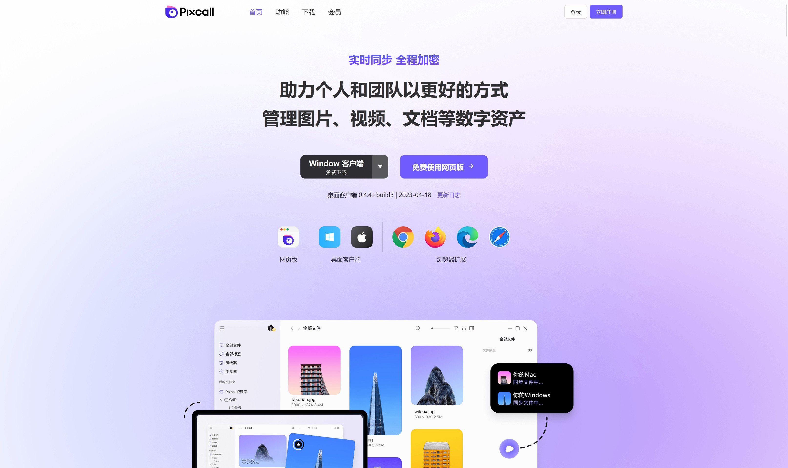

## [Pixcall](https://pixcall.com/)<badge text="基础功能免费" type="info"/>

Pixcall 是一款专为创作者和设计师打造的本地优先素材管理软件，支持多端同步、文件预览与聚合搜索，帮助用户高效收集、整理与调用各类创作资源。

特性：
- 所有数据均保存在本地，离线可用，访问快速。
- 可通过浏览器扩展、导入本地文件等方式收集图片、视频等内容。
- 内置浏览器可同时搜索 10 个主流素材网站，快速查找灵感。
- 能够直接预览大量的文件类型。

## [Eagle](https://cn.eagle.cool/)<badge text="买断制" type="info"/>

Eagle 是一款专为设计师与创意工作者打造的素材管理软件，集收藏、整理、搜索与预览于一体，支持图片、视频、音频、字体等多种格式，具备标签分类、智能文件夹、一键截图、浏览器扩展、多维筛选与 AI 功能等，帮助你高效打造专属的灵感资料库。  

特性：
- 支持几乎所有的素材类型。
- 可以对素材进行标记方便后期查找。
- 更新速度快且成熟。
