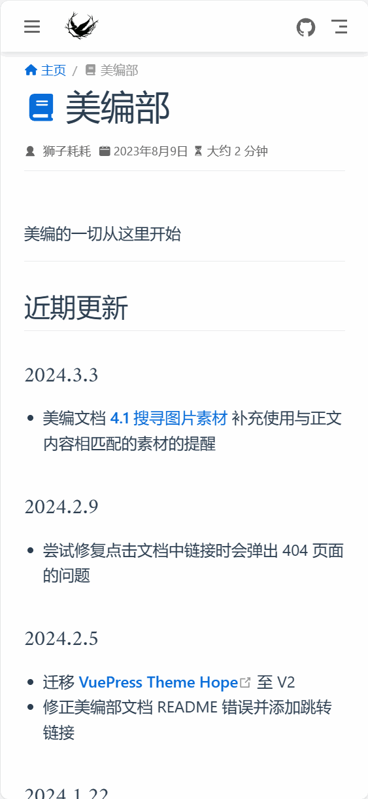
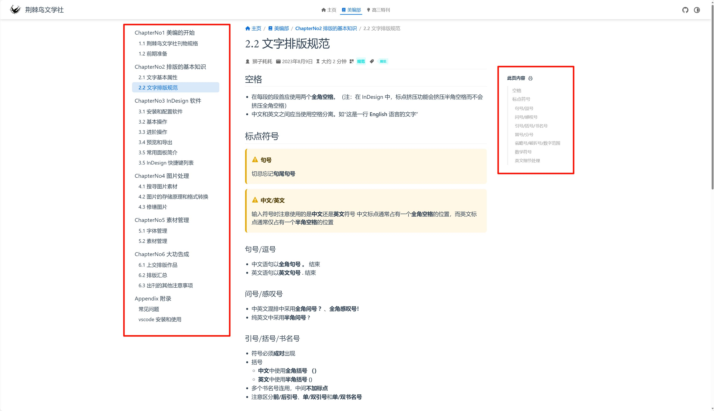

欢迎来到荆棘鸟文学社美编文档！🎉

美编的一切从这里开始。✨

::: info InDesign 版本声明
文档内容均基于 InDesign 2022 17.4 版本编写，不同版本间存在一定差异
:::

网站总访问量 Loading

## 最近更新
### 2025.8.27
- 更新 [项目维护信息](#项目维护) 中的项目托管地址

> [附录：历史更新日志](Appendix/changelog.md)

## 内容指引
如果你是初次进行美编工作，我们推荐你先阅读 [1.2 美编全流程](ChapterNo1/1.2.md)。

倘若你已经是美编部一名成熟的~~小鸽子~~了，你可以在菜单栏中选择你想查看的章节进行阅读。

::: info 文学社公开资源
[附录：文学社公开资源](Appendix/resource.md)
:::

## 网站操作指南
### 手机端
- 点击左上角的按钮可以打开文档目录
- 点击目录中的标题可以跳转到对应的页面

### PC 端
- 左侧为文档目录，右侧为本页内容的导航，点击即可跳转到对应的页面或位置

## 项目维护
该文档目前托管在 [Gitea](https://gitea.lionhao.top/jjnwxs/jingji_TSreference_vue)，由 @狮子耗耗 维护。

如果你有任何意见、评论以及建议，请通过邮件发送至邮箱 [szhhlionhao@qq.com](mailto:szhhlionhao@qq.com)，或通过 GitHub 的 Issues 页面进行反馈。